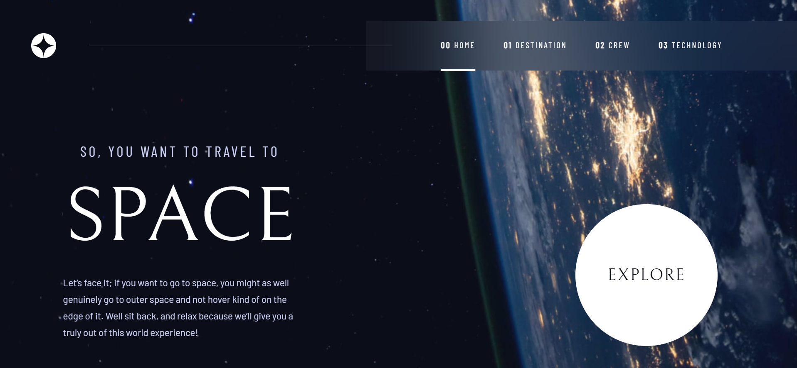

# Frontend Mentor - Space tourism website solution

This is a solution to the [Space tourism website challenge on Frontend Mentor](https://www.frontendmentor.io/challenges/space-tourism-multipage-website-gRWj1URZ3). Frontend Mentor challenges help you improve your coding skills by building realistic projects. 


## Table of contents

- [Overview](#overview)
  - [The challenge](#the-challenge)
  - [Screenshot](#screenshot)
  - [Links](#links)
- [My process](#my-process)
  - [Built with](#built-with)
  - [What I learned](#what-i-learned)
- [Author](#author)


## Overview

### The challenge

Users should be able to:

- View the optimal layout for each of the website's pages depending on their device's screen size
- See hover states for all interactive elements on the page
- View each page and be able to toggle between the tabs to see new information


### Screenshot




### Links

- Solution URL: [https://github.com/felix-D2/space-tourism-website/tree/design/space-tourism-website-main-VueJs/cli-version](https://your-solution-url.com)
- Live Site URL: [https://space-tourism-website-felix.netlify.app](https://your-live-site-url.com)


## My process

### Built with

- Semantic HTML5 markup
- CSS custom properties
- Flexbox
- Desktop-first workflow
- [Vue.js](https://vuejs.org/) - JS framework
- [Netlify](https://www.netlify.com/) - Cloud computing, with automated deploys


### What I learned

```html
<h1>Some HTML code I'm proud of</h1>

     <router-link to="/"
            class="linkNav"> 

              <span>00</span> Home
              <div class="linkNavUnderline"></div>
            </router-link>
            
            ...
            
            <router-view/>
```
```css
.fuzzyRectangle
{
  ...
  backdrop-filter: blur(81.5485px);
}


.technology 
{
  ...

  background:  center fixed no-repeat url("/images/technology/background-technology-desktop.jpg");
  background-size: cover;   /* Background resize */

  overflow: auto;
}


.linkNavUnderline
{
  ...
  pointer-events: none;

  transition: opacity 0.3s;
}
```
```js
...mapState(['data']),

destinationData() {
  return this.data.technology[this.technology];
},

```


## Author

- Frontend Mentor - [@felix-D2](https://www.frontendmentor.io/profile/felix-D2)
- Github - [@felix-D2](https://github.com/felix-D2)

<<<<<<< HEAD
=======
========
# Frontend Mentor - Space tourism website solution

This is a solution to the [Space tourism website challenge on Frontend Mentor](https://www.frontendmentor.io/challenges/space-tourism-multipage-website-gRWj1URZ3). Frontend Mentor challenges help you improve your coding skills by building realistic projects. 


## Table of contents

- [Overview](#overview)
  - [The challenge](#the-challenge)
  - [Screenshot](#screenshot)
  - [Links](#links)
- [My process](#my-process)
  - [Built with](#built-with)
  - [What I learned](#what-i-learned)
- [Author](#author)


## Overview

### The challenge

Users should be able to:

- View the optimal layout for each of the website's pages depending on their device's screen size
- See hover states for all interactive elements on the page
- View each page and be able to toggle between the tabs to see new information


### Screenshot


### Links

- Solution URL: [https://github.com/felix-D2/space-tourism-website/tree/design/space-tourism-website-main-VueJs/cli-version](https://your-solution-url.com)
- Live Site URL: [https://space-tourism-website-felix.netlify.app](https://your-live-site-url.com)


## My process

### Built with

- Semantic HTML5 markup
- CSS custom properties
- Flexbox
- Desktop-first workflow
- [Vue.js](https://vuejs.org/) - JS framework
- [Netlify](https://www.netlify.com/) - Cloud computing, with automated deploys


### What I learned

```html
<h1>Some HTML code I'm proud of</h1>

     <router-link to="/"
            class="linkNav"> 

              <span>00</span> Home
              <div class="linkNavUnderline"></div>
            </router-link>
            
            ...
            
            <router-view/>
```
```css
.fuzzyRectangle
{
  ...
  backdrop-filter: blur(81.5485px);
}


.technology 
{
  ...

  background:  center fixed no-repeat url("/images/technology/background-technology-desktop.jpg");
  background-size: cover;   /* Background resize */

  overflow: auto;
}


.linkNavUnderline
{
  ...
  pointer-events: none;

  transition: opacity 0.3s;
}
```
```js
...mapState(['data']),

destinationData() {
  return this.data.technology[this.technology];
},

```


## Author

- Frontend Mentor - [@felix-D2](https://www.frontendmentor.io/profile/felix-D2)
- Github - [@felix-D2](https://github.com/felix-D2)

>>>>>>>> 8c2074f0331ba4efd5607c9c3592ec2d60a4d30a:README.md
>>>>>>> 8c2074f0331ba4efd5607c9c3592ec2d60a4d30a
